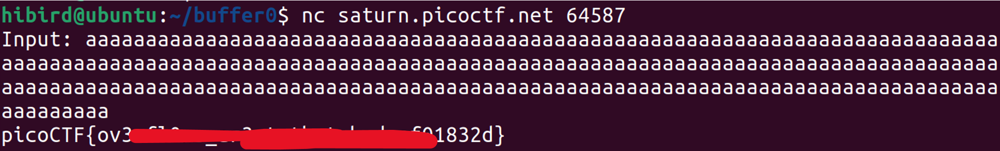

# buffer overflow 0

- **Category:** Pwnable
- **Difficulty:** Easy

## 1. Phân tích bài

1. Source

```jsx
#include <stdio.h>
#include <stdlib.h>
#include <string.h>
#include <signal.h>

#define FLAGSIZE_MAX 64

char flag[FLAGSIZE_MAX];

void sigsegv_handler(int sig) {
  printf("%s\n", flag);
  fflush(stdout);
  exit(1);
}

void vuln(char *input){
  char buf2[16];
  strcpy(buf2, input);
}

int main(int argc, char **argv){
  
  FILE *f = fopen("flag.txt","r");
  if (f == NULL) {
    printf("%s %s", "Please create 'flag.txt' in this directory with your",
                    "own debugging flag.\n");
    exit(0);
  }
  
  fgets(flag,FLAGSIZE_MAX,f);
  signal(SIGSEGV, sigsegv_handler); // Set up signal handler
  
  gid_t gid = getegid();
  setresgid(gid, gid, gid);

  printf("Input: ");
  fflush(stdout);
  char buf1[100];
  gets(buf1); 
  vuln(buf1);
  printf("The program will exit now\n");
  return 0;
}

```

b) Nhận xét

- Hàm gets tại dòng code gets(buf1): hàm này không kiểm tra kích thước vùng nhớ dùng để chứa dữ liệu nhập cho nên sẽ xảy ra tràn bộ đệm nếu như dữ liệu nhập dài hơn kích thước của bộ đệm
- Dòng code signal(SIGSEGV, sigsegv_handler): đăng ký hàm sigsegv_handler để xử lý tín hiệu SIGSEGV. Khi chương trình gặp lỗi segmentation fault, hàm này sẽ được gọi
- void sigsegv_handler(int sig): hàm này được gọi khi chương trình gặp lỗi segmentation fault (SIGSEGV). Lỗi này thường xảy ra khi chương trình truy cập vào vùng nhớ không hợp lệ

## 2. Ý tưởng khai thác

- Chúng ta chỉ cần nhập biến buf1 với số ký tự vượt quá 100, khi đó chương trình sẽ gặp lỗi segmentation fault, hàm sigsegv_handler sẽ được gọi và ta nhận được flag

## 3. Chạy script

